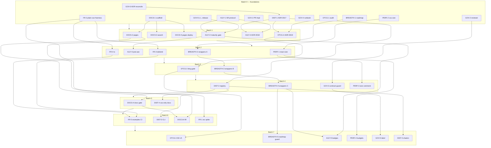

# UIx v2 — Audit-driven improvement plan

**Source:** `UIx-v2-Comparative-Audit.docx` (3 July 2026).
**Goal:** close the gaps the audit scored below 5/5 — without re-architecting anything — as **vertical
slices** grouped into **batches** that other agents can build in parallel context windows.
**Status:** planning artifact. Nothing here is built yet.

> This plan was produced by an 8-way parallel deep-dive + synthesis + adversarial critique. The critique
> found 10 defects in the first synthesis; **all 10 fixes are folded in below** (see
> [§7 Corrections applied](#7-corrections-applied-vs-the-first-synthesis)). Read this README first, then hand
> each `batch-N.md` to a fresh agent.

---

## 1. What the audit said

UIx v2 scored **at or above enterprise standard on the expensive-to-build core** (token contract 5/5,
zero-runtime styling 5/5, CI trust-gates 5/5, governance 5/5) and **weakest on surface-area and proof**:

| Dimension | Score | Gap the plan closes |
|---|---|---|
| Token architecture | 5/5 | (hold) + DTCG-2025.10 alignment guard |
| Styling / runtime perf | 5/5 | (hold) + published bundle budgets |
| Testing & CI | 5/5 | (hold) + new gates for every new surface |
| Versioning & governance | 5/5 | (hold) + bus-factor-1 hardening |
| Theming & multi-brand | 4/5 | documented; end-user theming out of scope |
| Framework reach | 4/5 | consumer examples + WC feasibility spike |
| A11y — automated | 4/5 | jest-axe over React components (axe blind spot) |
| **Component breadth** | **3/5** | 16 missing wrappers + public roadmap |
| **Documentation & DX** | **3/5** | **public component-explorer docs site** |
| **Distribution & adoption** | **3/5** | registry/copy-in companion + ADR |
| **A11y — certified/manual** | **2/5** | **manual SR protocol + maturity model** |
| **Measured-performance evidence** | **2/5** | **size-limit budgets in CI** |

Audit priority order (leverage): **P1** docs site + manual-a11y protocol · **P2** perf budgets +
distribution decision + DTCG alignment · **P3** bus-factor-1 + breadth roadmap + web-components.

## 2. Grounding facts (read from git HEAD — the working tree has `packages/` staged for deletion)

- Monorepo: `packages/tokens` (DTCG → Style Dictionary v4 → `--uix-*` contract + Tailwind theme + typed TS;
  gated by `check-parity.mjs` byte-parity and `check-contract.mjs` completeness) and `packages/react`
  (**44 wrappers already exported** + `table-engine` + hooks; tsup dual build, per-file `use client`,
  `./chart` split, api-extractor lock).
- **67** CSS component files in `packages/tokens/styles/components/`. **16** have no React wrapper yet
  (the `design-system.md` "coverage backlog" is **stale** — Meter/Progress/Segmented/Inbox/Comments/Timeline/
  Kanban/CommandPalette/DescriptionList/Composer are already wrapped; BREADTH-1 corrects it).
- Styleguide substrate for the docs site: `packages/tokens/index.html` + `guide/app.js` (~906 lines of
  tested pure helpers behind a DOM guard) + `dashboard.html` + `tables.html`, build-free, no-flash theming.
- CI (`.github/workflows/ci.yml`) has 3 jobs — **gates** (build:all, parity, contract, api, smoke),
  **visual** (Playwright VR in the pinned `mcr.microsoft.com/playwright:v1.61.0-jammy` container; goldens are
  committed `*-linux.png`), **a11y** (axe WCAG2.1 A/AA over 3 pages, light+dark, allowlist empty/enforced).
  `release.yml` is a **hand-maintained copy** of those gates (see correction C3).
- Governance: single-source policy (`Docs/design-system.md`), written `Docs/contract-change-process.md`
  (the bus-factor-1 stand-in), ADR log at `E:/Development/Docs/adr/` (**0000–0012 present; 0013–0016 are
  cited-but-unwritten**), index regenerated by `E:/Development/Infrastructure/agent-kits/adr-kit/gen-adr-index.mjs`.

## 3. Design principles for the slices

1. **Vertical, not horizontal.** Each slice is independently shippable and *verifiable by a command or gate*
   ("docs scaffold + Button + Table pages + a coverage gate" — not "document all 45 components").
2. **Gate every new surface.** New capability lands with the CI check that keeps it true (size budgets,
   docs-coverage, DTCG-validity, registry-drift, maturity-status, roadmap-coverage).
3. **Contract-safety is absolute.** Token/DTCG work is either pure analysis or byte-parity-preserving
   (`test:parity` stays green) or it goes through the contract-change process. No slice edits
   `tokens.baseline.css` to make parity pass — that's the tripwire, not an obstacle.
4. **Prefer new files; serialize the few hotspots.** The synthesis analyzed `creates`/`modifies` overlap so
   no two concurrently-running slices fight over a file. The real hotspots are: `.github/workflows/ci.yml`
   (gates job), `packages/react/src/index.ts` + `etc/uix-react.api.md` (whole-surface generated — the wrapper
   chain is **strictly serial**), `packages/tokens/index.html` (demo blocks), `README.md`, `package.json`
   script maps, and the generated `adr/README.md` index.

## 4. The 41 slices by workstream

IDs are stable. Effort S/M/L. Full acceptance + verify live in each `batch-N.md`. `★` = audit P1.

| Workstream | Slices (in dependency order) |
|---|---|
| **Docs site** (Docs/DX 3→) | ★DOCS-1 scaffold · ★DOCS-2 Button+Table pages · ★DOCS-3 search · ★DOCS-5 Pages deploy · DOCS-4 coverage gate · DOCS-6 fill remaining pages |
| **Manual a11y + maturity** (2→) | ★A11Y-1 SR protocol · ★A11Y-2 maturity registry+gate · A11Y-3 jest-axe React harness · A11Y-4 ADR-0018 VPAT deferral · A11Y-5 styleguide status badges |
| **Perf evidence** (2→) | PERF-2 CSS size report · PERF-1 React size budgets (CI job) · PERF-3 PR size-diff comment · PERF-4 budgets doc |
| **Distribution** (3→) | DIST-1 ADR-0017 the bet · DIST-2 registry.json + drift gate · DIST-4 components.json + CSS-only docs · DIST-3 `uix add` copy-in CLI · DIST-5 shadcn registry *(conditional)* |
| **DTCG alignment** (5/5 hold) | DTCG-1 conformance audit · DTCG-4 ADR-0019 revision policy · DTCG-2 DTCG-validity gate · DTCG-3 Style Dictionary v4→v5 readiness |
| **Governance / bus-factor** (5/5 hold) | GOV-0 reconcile ADR log · GOV-6 ci↔release lockstep · GOV-1 PR template · GOV-2 reviewer policy · GOV-3 contract-guard gate · GOV-4 maintainer runbook · GOV-5 contract-change label |
| **Breadth** (3→) | BREADTH-1 roadmap+fix stale backlog · BREADTH-2 wrappers A · BREADTH-3 wrappers B · BREADTH-4 wrappers C · BREADTH-5 roadmap-coverage guard |
| **Framework reach** (4→) | FR-2 plain-CSS example+harness · FR-3 Tailwind example · FR-4 TS example · FR-5 examples CI + bundle docs · FR-1 web-components spike |

Coverage map (every dimension scored <5 has ≥1 slice) is in [§8](#8-audit-dimension-coverage).

## 5. Pre-flight — ✅ done (2026-07-03)

1. **`packages/` "staged deletion" — investigated and resolved.** It was **never a git deletion**: HEAD always
   held all 179 tracked files. The session-start state was a working-tree-only removal (no commit, no reflog
   trace) that has since been restored **byte-identical to HEAD** (`git diff HEAD -- packages` is empty). The
   only real gap was uninstalled workspace dependencies (root `node_modules` had just the 17 root devDeps) —
   fixed with **`npm ci`**. Verified green: `npm run build` + `test:parity` (214 `--uix-*` decls match baseline)
   + `test:contract`; `esbuild` works so the React build is fine. **The tree is clean and every batch branches
   from a healthy `master`** — no destructive restore needed (correction C10). *Optional cleanliness:* npm's
   allow-scripts policy blocked 3 postinstall scripts (`style-dictionary` patch-package, `esbuild` install.js,
   `glob` patch-package) — harmless here (parity green, esbuild functional); approve with
   `npm approve-scripts --allow-scripts-pending` only if you want them run.
2. **Distribution bet — decided: option C.** A copy-in manifest (`registry.json`) + a tiny `uix add` CLI for
   CSS-only/non-React consumers; React stays npm-canonical. DIST-1 (Batch 0) records this as ADR-0017. This
   resolves the conditional cascade (correction C8) — DIST-2/3/4 are IN; **DIST-5 (full shadcn registry) stays
   optional**; the option-A fallback text in DIST-4 is not exercised.

## 6. Batches & how to run them in parallel

The 8 batches are the **safe, dependency-correct sequence** (`batch-0` first; each later batch assumes the
prior merged). Within a batch, one agent implements all listed slices; the file sets are disjoint.

| Batch | Theme | Depends on | Slices | Adds CI gate to |
|---|---|---|---|---|
| **[0](batch-0.md)** | Foundations: scaffolds, ADRs, protocol docs, harnesses, lockstep | — | GOV-0, GOV-6, DOCS-1, A11Y-1, DIST-1, DTCG-1, GOV-1, GOV-2, GOV-4, PERF-2, FR-2, BREADTH-1 | ci↔release reuse (GOV-6) |
| **[1](batch-1.md)** | Docs pages + search + Pages, maturity registry, conditional ADRs | 0 | DOCS-2, DOCS-3, DOCS-5, A11Y-2, A11Y-4, DTCG-4 | `maturity-status` (A11Y-2) |
| **[2](batch-2.md)** | React size budgets, jest-axe harness, wrappers A, TW/TS examples | 1 | PERF-1, **A11Y-3**, BREADTH-2, FR-3, FR-4 | `size` + `react-a11y` jobs |
| **[3](batch-3.md)** | DTCG-validity gate + wrappers B | 2 | DTCG-2, BREADTH-3 | `dtcg` (DTCG-2) |
| **[4](batch-4.md)** | Registry manifest + wrappers C + contract-guard + size comment | 3 | DIST-2, BREADTH-4, GOV-3, PERF-3 | `registry` + standalone guards |
| **[5](batch-5.md)** | Docs-coverage gate + non-React consumer docs | 4 | DOCS-4, DIST-4 | `docs-coverage` (DOCS-4) |
| **[6](batch-6.md)** | Examples CI + copy-in CLI + fill doc pages + WC spike | 5 | FR-5, DIST-3, DOCS-6, FR-1 | `examples` (FR-5) |
| **[7](batch-7.md)** | SD v5 readiness, roadmap guard, status badges, budgets, label, shadcn | 6 | DTCG-3, BREADTH-5, A11Y-5, PERF-4, GOV-5, DIST-5 | `roadmap` (BREADTH-5) |

### The real parallelism is by workstream

The `0→1→…→7` chain is the conservative order. In practice, **after Batch 0 merges you can run ~5 windows
concurrently, one per workstream** (Docs, Perf, DTCG, Governance, Framework-reach can all proceed once their
Batch-0 foundation exists), because their file sets barely overlap. The genuine constraints on concurrency:

- **The wrapper chain is strictly serial:** BREADTH-2 → BREADTH-3 → BREADTH-4 (each regenerates the
  whole-surface `etc/uix-react.api.md` and appends to `src/index.ts` + `index.html`). Keep it in **one lane**.
- **`ci.yml` gates-job step additions** across concurrent windows produce trivial *append* conflicts. Either
  serialize the merges of gate-adding slices, or (preferred) let standalone workflow files
  (`contract-guard.yml`, `size-report.yml`, `docs-pages.yml`, and A11Y-3's `react-a11y` job) carry what they
  can. Because GOV-6 makes `release.yml` *reuse* `ci.yml`, a step added once is automatically a publish gate.
- **`index.html` demo blocks** (BREADTH-2/3/4, A11Y-5) and their **VR goldens**: after any `index.html`
  change, regenerate the committed `*-linux.png` goldens via the pinned container
  (`docker run --rm -v "$PWD":/w -w /w mcr.microsoft.com/playwright:v1.61.0-jammy npm run test:visual:update`)
  or the `update-visual-goldens` workflow — **never hand-edit the PNGs, and don't assert local `test:visual`
  on Windows** (correction C4). Batch that re-baseline into one lane.
- **Append-only shared files** (`README.md`, `package.json` script maps, generated `adr/README.md`): resolve
  trivial append conflicts at merge; never reorder existing keys (correction C7).

**Suggested concurrency after Batch 0:** open windows for `{Docs}`, `{Perf}`, `{DTCG}`, `{Governance}`,
`{Framework-reach}` in parallel; run `{Breadth+A11y-badges}` as a single serial lane; merge frequently and
run one VR-golden re-baseline pass whenever `index.html` changed.

## 7. Corrections applied vs. the first synthesis

The adversarial critic caught these; the fixes are baked into the batch files.

| # | Sev | Defect | Fix |
|---|---|---|---|
| C1 | high | **A11Y-3 was defined but scheduled in no batch** (the only automated-React-a11y coverage). | Scheduled in **Batch 2** as a **new `react-a11y` CI job** (dep A11Y-2). Splittable to its own window. |
| C2 | high | Batch-2 `sliceIds` listed 6 but prose ran 4 (3-way `ci.yml` collision). | Batch 2 = PERF-1, A11Y-3, BREADTH-2, FR-3, FR-4. DTCG-2→B3, DIST-2→B4. |
| C3 | high | `release.yml` does **not** inherit `ci.yml`; new gates wouldn't gate publish. | **GOV-6** (Batch 0) refactors `release.yml` to `uses: ./.github/workflows/ci.yml` (`workflow_call`). Every later gate auto-mirrors. |
| C4 | high | VR goldens are Linux/`*-linux.png`, unregenerable locally on Windows; `index.html` edits also feed `test:a11y`. | `index.html`-mutating slices: don't assert local `test:visual`; re-baseline via pinned container / `update-visual-goldens`; add an axe-triage acceptance on the new demo markup. |
| C5 | med | Contract-guard path list (`packages/tokens/scripts/`) too broad → false trips on new non-contract scripts. | Narrow to `style-dictionary.config.mjs`, `build-styles.mjs`, `build-themes.mjs`, `check-parity.mjs`, `check-contract.mjs` (+ `tokens/`, `themes/`, `tokens.baseline.css`). GOV-3 & GOV-5 mirror it. |
| C6 | med | New ADRs reused 0013–0015, which the codebase already cites (0013–0016) but never wrote. | **GOV-0** backfills 0013–0016 from cited sources; new ADRs are **0017** (DIST), **0018** (VPAT), **0019** (DTCG). |
| C7 | med | Batches marked `parallelSafe` while needing ordered edits to a shared `package.json`. | One agent per batch → intra-batch edits are serial. Cross-window: merge-order rule in §6. |
| C8 | med | DIST-1 could pick npm-only, cancelling DIST-2..5 and leaving dangling refs. | Pre-commit the bet in pre-flight (default option C); DIST-4 has an option-A fallback. |
| C9 | low | Several `verify`s are reviewer-judgment, not runnable. | Tagged "manual review — no CI gate"; added grep-able checks where feasible; DOCS-5/PERF-3 verify is post-merge. |
| C10 | low | Every batch repeated the destructive `packages/` restore (a snapshot artifact). | Resolved once in pre-flight; batches assume clean `master`. |

## 8. Audit-dimension coverage

- **Docs/DX (3→):** DOCS-1,2,3,5,6 · A11Y-5 · BREADTH-1 · GOV-4 · DIST-4 · PERF-4
- **A11y-manual (2→):** A11Y-1,2,4,5 · **A11y-automated (4→):** A11Y-3
- **Measured-performance (2→):** PERF-1,2,3,4
- **Distribution (3→):** DIST-1,2,3,4,5 · DOCS-5
- **Breadth (3→):** BREADTH-1,2,3,4,5
- **Framework reach (4→):** FR-1,2,3,4,5 · DIST-3
- **Token architecture / Theming (5,4 hold):** DTCG-1,2,3,4
- **Testing/CI (5 hold):** every gate-adding slice above
- **Governance (5 hold):** GOV-0,1,2,3,4,5,6 · DIST-1 · A11Y-4 · DTCG-4 · PERF-4

## 9. Dependency graph

